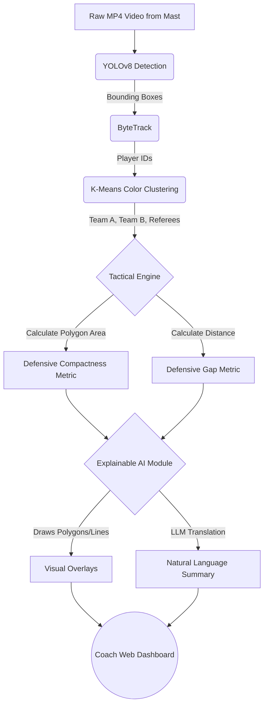
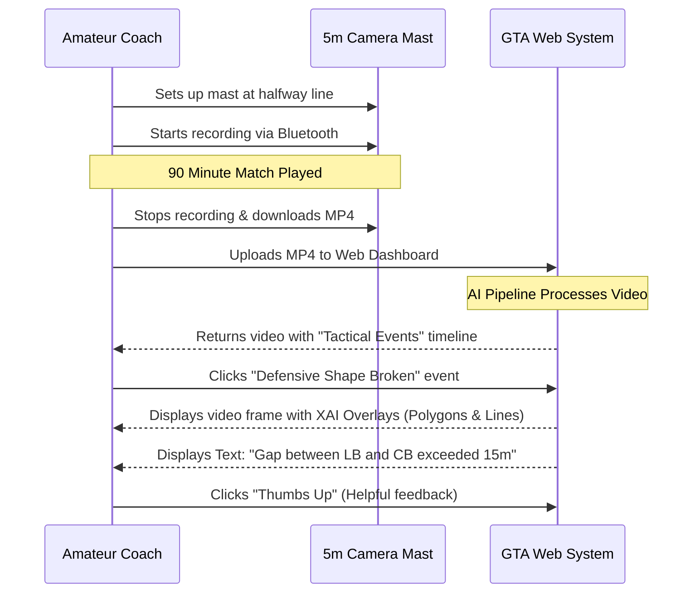
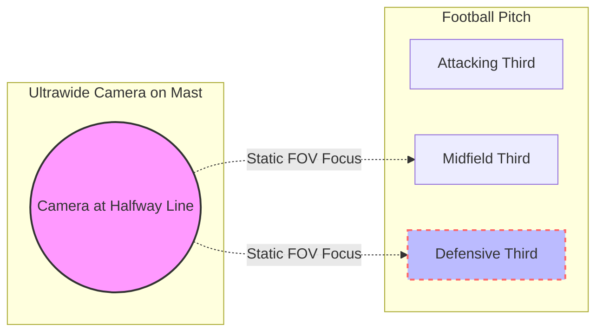

# System Architecture and Workflow Diagrams

These diagrams visualize the flow of data and the user experience for your Grassroots Tactical Assistant (GTA) prototype. You can include these flowcharts in your final paper to clearly illustrate your system design.

## 1. The AI & Computer Vision Pipeline
This diagram shows how raw video is processed into explainable tactical insights.

## 2. The HCI / Coach Workflow
This diagram illustrates the human-centered process, from setting up the camera to receiving tactical feedback.

## 3. The 180-Degree Workaround (Tactical Focus)
If you choose the "Tactical Focus" workaround discussed in the logistics math, here is how the camera capture zones work.

